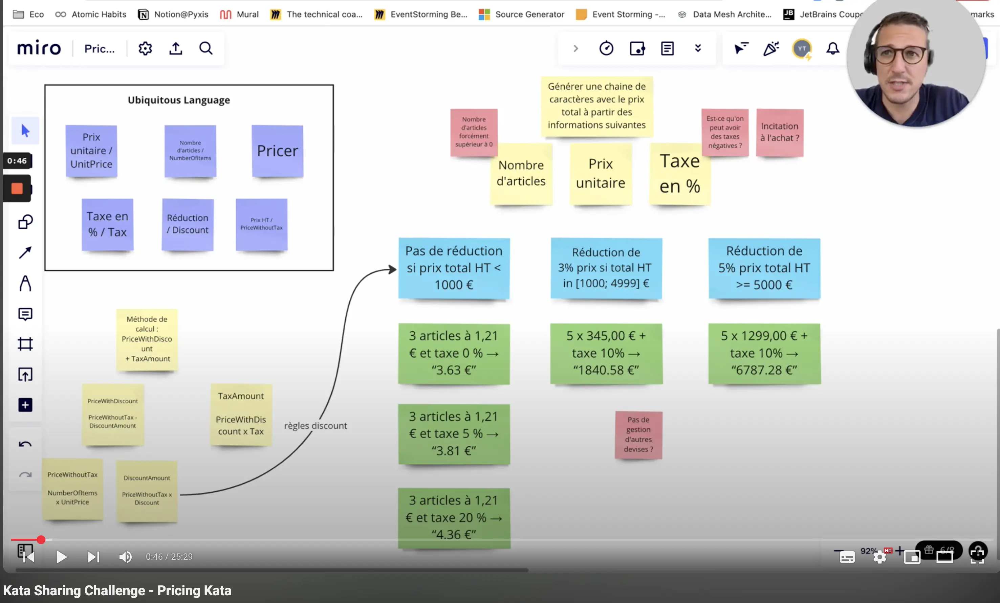

# Le TDD par [Yoan Thirion](https://www.linkedin.com/in/yoanthirion/)
Le TDD est une technique née d’un ensemble de convictions sur le code :

* La simplicité – l’art de maximiser le travail *non* fait
* L’évidence et la clarté sont plus vertueuses que l’ingéniosité
* Écrire du code épuré et simple est une composante clé du succès

C’est une méthodologie issue de l’Extreme Programming (XP), développée par Kent Beck.
> *"Le Test-Driven Development est une manière de gérer la peur pendant le développement" – Kent Beck*

## Concevoir et structurer le code
Le Test-Driven Development ne consiste **pas** à tester le code.
Les tests sont un moyen, pas un objectif.

Il s’agit de :
* Améliorer la conception / structure du code
* Nous permettre de **refactorer en toute sécurité** grâce aux tests

## Un parti pris vers la simplicité
Il existe plusieurs manières de mesurer la simplicité d’un logiciel :

* Moins de lignes de code par fonctionnalité
* Complexité cyclomatique plus faible
* Moins d’effets de bord
* Besoins en mémoire / exécution plus faibles

Le TDD nous oblige à produire la solution la plus simple qui fonctionne :

* Ne pas écrire plus de code que nécessaire (**YAGNI**)
* Résister à la tentation d’ajouter de la complexité accidentelle / artificielle

## Une confiance accrue
Le TDD augmente notre **confiance dans le code** :

* Chaque nouveau test exerce le système de manière nouvelle, non testée auparavant
* Au fil du temps, la suite de tests nous protège contre les régressions
* Nous bénéficions constamment d’un retour rapide sur l’état du système (boucle de feedback rapide)

Cela favorise également la **confiance entre les membres d’une équipe** :

* Chacun peut modifier ou refactorer du code écrit par un autre sans craindre de tout casser
* Les tests deviennent un langage commun pour exprimer les intentions métier et techniques
* Le code devient plus lisible et prédictible, facilitant la collaboration
* On se repose sur la suite de tests comme garantie collective de qualité, et non sur des individus

---

## Les fondations du TDD
Le TDD est une approche que l'on peut avoir comme scientifique du développement logiciel :

* Émettre une hypothèse
* Réaliser une expérience
* Observer le résultat
* Essayer quelque chose de nouveau
* Refaire l’expérience
* Observer le résultat
* Essayer encore quelque chose de nouveau
* etc.

Un processus en 3 phases :

* 🔴 on écrit un test qui échoue
  * Incluant d’éventuelles erreurs de compilation
  * On exécute la suite de tests pour vérifier l’échec
* 🟢 : on écrit **juste assez de code** pour que le test passe
  * On devient un "développeur sale" un instant :
    * Valeurs en dur
    * Duplication
    * Copié-collé
  * Cette étape doit être rapide
  * On exécute la suite de tests pour confirmer
* 🔵 **Refactoring** : on nettoie le code
  * Duplication, valeurs codées en dur, usage incorrect du langage, etc.
  * Si un test échoue durant cette phase :
    * Revenir au vert est prioritaire avant de sortir de cette étape
    * Plus cela prend de temps, plus c’est risqué
    * Éviter le biais du coût irrécupérable (sunk cost fallacy)

[](https://tddmanifesto.com/getting-started/)

---

## Ma pratique
Je commence par un exercice d'[**Example Mapping**](https://xtrem-tdd.netlify.app/Flavours/Practices/example-mapping) à partir d’un item du backlog (User Story, Job Story, etc.) :
* Réaliser l’exercice avec les parties prenantes métier, ou seul si nécessaire
* Clarifier l’objectif et les étapes nécessaires pour l’atteindre
* Identifier les **cas passants** et **non passants**

[](https://youtu.be/v0xUUKDYUt0?si=SF_ugOAHaXm4JC1I)

J'étais heureux que Kent Beck clarifie cette partie `Test List` ces dernières années parce que c'était un élément souvent peu vu / compris par les devs s'essayant à `TDD` : `comment je commence ?` (le fameux syndrôme de la page blanche).

[](https://tidyfirst.substack.com/p/canon-tdd)

J'aime commencer par un premier **cas non passant**, car cela me permet de :

* Définir la signature de l’élément à créer (exception, monade, retour API, etc.)
* Réfléchir au type de test à écrire en premier : test d’exemple ou test de propriété

Je le fais de cette manière peu importe l'approche ou design utilisés (Inside-Out / Outside-In / Type-Driven).

Pour les cas non passants, il m'arrive de partir avec un premier **test de propriété** qui va m'aider à itérer :

```text
Quel que soit le contributeur à ce challenge
Il ne pourra pas pousser sa contribution sur le repo d'origine car celui-ci est "protégé"
```

---


### Avantages
* **Clarté** : chaque test que j'écris rend explicite mon objectif immédiat. Je sais exactement ce que je cherche à accomplir, et je sais quand j'ai terminé avec cette étape.
* **Focus** : le découpage en micro-tâches m’aide à rester concentré. Une tâche à la fois, un petit pas après l’autre : moins de dispersion, plus de fluidité.
* **Combattre mes biais** : en écrivant d’abord le test, je décris le comportement attendu sans être influencé par l’implémentation. Ça m’oblige à sortir de ma tête pour me confronter à l’usage réel en tant que client du code.
* **Meilleure compréhension du besoin** : formaliser le comportement à travers des tests m’oblige à poser des questions, à lever des ambiguïtés.
* **Confiance** : avec les boucles de feedback rapides, je peux itérer sans crainte. Le filet de sécurité des tests m’encourage à refactorer, à oser simplifier, à aller plus loin sans peur.