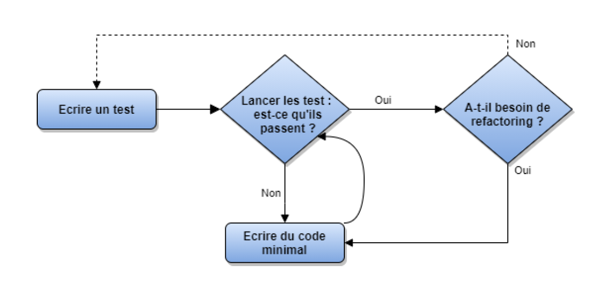

# Le TDD par Yann Courtel

Bonjour la communauté !  
Je suis [Yann Courtel](https://www.linkedin.com/in/yanncourtel/) et aujourd'hui, nous allons discuter d'une définition du TDD.

Je pratique le TDD depuis plusieurs années et j'essaie d'adopter une approche pragmatique plutôt que dogmatique.  
Recherchons, par l'essence de la méthode, l'objectif derrière celle-ci et pourquoi c'est toujours un sujet en vogue.

## L'essence du TDD

Le TDD est une méthodologie de travail basée sur l'écriture de tests automatisés pour faire émerger un design de code de la manière la plus incrémentale possible. La complexité du code produit évolue inversement à la confiance que nous avons en celui-ci.

Il a été introduit au début des années 2000 par Kent Beck dans l'ensemble des pratiques de l'Extreme Programming.  
L'idée est de se laisser guider par le feedback de ces tests.

## Le design émergeant

Le principal bénéfice d'une méthodologie de travail comme le TDD est de voir émerger un design taillé sur mesure pour notre besoin. Cela permet d'éviter un code trop complexe, de ne rien oublier du besoin, de se focaliser de façon incrémentale sur la qualité du code et de pouvoir tester exhaustivement nos besoins en amont.

## J'incrémente en continu avec le baby step

Le concept de "baby step" (petit pas en français) est primordial pour construire notre code final.

Il s'agit de trouver l'itération la plus petite et pertinente de notre code de test pour faire progresser le code de production.

Se poser constamment la même question : quelle est la modification la plus petite dans mes tests qui m'aide à faire évoluer mon implémentation ?

## On pose les règles (ou pas ?)

Robert C. Martin a énoncé des règles auxquelles on peut se référer pour structurer notre pensée lorsque l'on débute en TDD :

1. Il n'est permis d'écrire du code de production que si un test unitaire est en échec.
2. Il n'est permis d'écrire qu'un nouveau test unitaire en échec à la fois (et un test unitaire qui ne compile pas compte déjà comme un test en échec).
3. Il n'est permis d'écrire que le code de production permettant directement de faire passer le test unitaire précédent, ni plus ni moins.

Ces règles peuvent aider lors de la montée en compétence. Par la suite, elles deviennent implicites.

## Par quoi je commence : les bons conseils

Avant de démarrer une nouvelle fonctionnalité, un nouvel applicatif ou un refactoring, il est important de faire un travail de cadrage.

D'autres méthodes existent, comme l'example mapping, pour clarifier le besoin et définir les questions à se poser avant de commencer à coder.  
Une simple liste de tâches suffit pour lancer l'exercice.

## Et en pratique ?

Le TDD est une boucle répétée jusqu'à ce que le besoin soit comblé et que le code atteigne une qualité suffisante. On observe trois étapes :

🔴 **RED** : écrire un test en échec (la compilation étant incluse)
- J'écris un test en échec qui me permet d'avancer dans la bonne direction.
- Je peux aussi recycler un test existant, c'est-à-dire rajouter des assertions le passant en échec, si j'ai déjà une suite de tests.

🟢 **GREEN** : faire passer le test le plus rapidement possible
- Je prends tous les raccourcis pour faire passer mon test.
- Je "hardcode" les parties que je ne maîtrise pas car cela dépasse mon baby step actuel.
- Je lance **toute** ma suite de tests, pas un test isolé.

🔵 **REFACTOR** : améliorer mon code
- Tous les principes Clean Code, SOLID, etc.
- Je vérifie également si je peux améliorer mon code de test.
- J'ajoute de manière sécurisée du tooling ou de l'abstraction si besoin.
- Dès que j'opère une action sur mon code, je relance tous mes tests.
  - Si plusieurs sont au rouge, je dois ... 
    1) ajouter les instructions nécessaires pour tout faire passer au vert rapidement.
    2) revenir au code précedent.
- Si une série de modifications est risquée, je fais des commits à chaque étape.
- Je dois toujours pouvoir revenir à cette étape, même si je laisse mon code plusieurs jours ou semaines.

Si je dois ajouter une fonctionnalité, je repars à l'étape **RED**.  
Si je modélise le processus, on obtient cet arbre de décision :  

## Ce que le TDD m'apporte

> "Je pourrai me concentrer dessus plus tard."

L'approche itérative me permet de compartimenter ma pensée pour réaliser mon besoin.

Je m'abstrais volontairement des tâches techniques, des langages, des patterns et des bibliothèques externes pour me focaliser sur l'objectif du moment.

De cette façon, toute mon attention est portée sur une petite tâche. Cela évite le travail horizontal ou en parallèle qui augmente la complexité.

## Les avantages de l'approche

Parmi les bénéfices indéniables :
- Je code en petites itérations, donc j'ai confiance dans le code produit.
- Je code sous tests, et seulement sous tests, ce qui évite les régressions liées au besoin.
- Je suis en capacité de refactorer quand je le souhaite, ce qui améliore mon efficacité.
- Mon code est simple et me sert de documentation.

## Les challenges en équipe et mes recommandations

> Je n'arrive pas à mettre en place le TDD dans mon équipe car nous avons déjà du code ?

Commencer simplement est essentiel. Ne passez pas de 0 % à 100 % des fonctionnalités en TDD du jour au lendemain.  
C'est le meilleur moyen d'échouer.  
Une petite user story avec un peu de métier sur un code testable (et/ou déjà testé) est un bon point de départ.

> J'écris tous mes tests avant de coder, est-ce un problème ?

Oui. L'essence du TDD n'est pas d'écrire des tests à l'avance, mais de faire émerger le code par les tests.  
La boucle de feedback, test par test, est nécessaire pour éviter de corriger plusieurs tests en même temps.  
Pire, on peut se retrouver avec 2 ou 3 tests qui passent au vert sans pouvoir expliquer pourquoi.

> J'ai une user story mais je ne sais pas par où commencer ?

Le syndrome de la feuille blanche est courant. D'où l'intérêt d'un example mapping ou d'une simple liste de scénarios avec exemples.  
Il peut être pertinent de se concentrer sur un cas simple ou un cas d'erreur pour valider la structure du code (classe, méthode, signature, moteur de test, etc.).  
Généralement, vous ferez plusieurs itérations sur un même test avant d'arriver au test final.

> Je trouve que le TDD n'est pas adapté à toutes les situations.

Le TDD n'est pas forcément applicable à tous les contextes.  
Certains applicatifs purement techniques ne nécessitent pas une méthodologie TDD.  
Il est tout à fait légitime de n'utiliser le TDD que partiellement.

> J'ai commencé en solo car mes collègues ne voulaient pas...

Il est important de respecter les volontés de chacun.  
Il est préférable d'adopter le TDD en équipe et de sensibiliser les collègues en amont.  
Encore mieux : capitaliser sur le travail fait en TDD pour introduire des pratiques collaboratives comme le mob programming, dans un esprit de partage et de bienveillance.

## Mot de la fin

Pratiquez ! Faites-vous votre propre idée. Puis, analysez si cela vous convient.  
Toujours dans un esprit de bienveillance et de partage.
